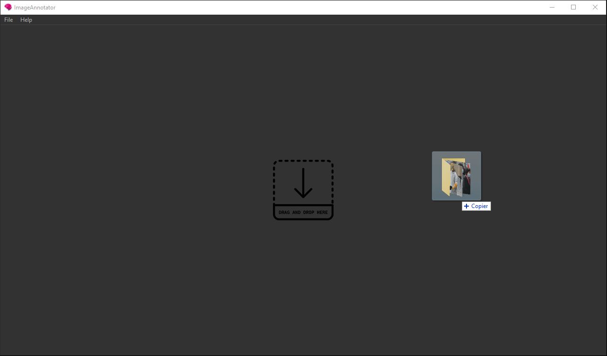
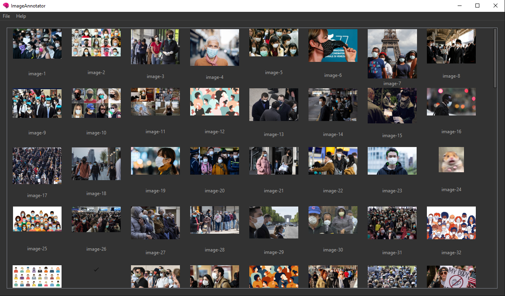
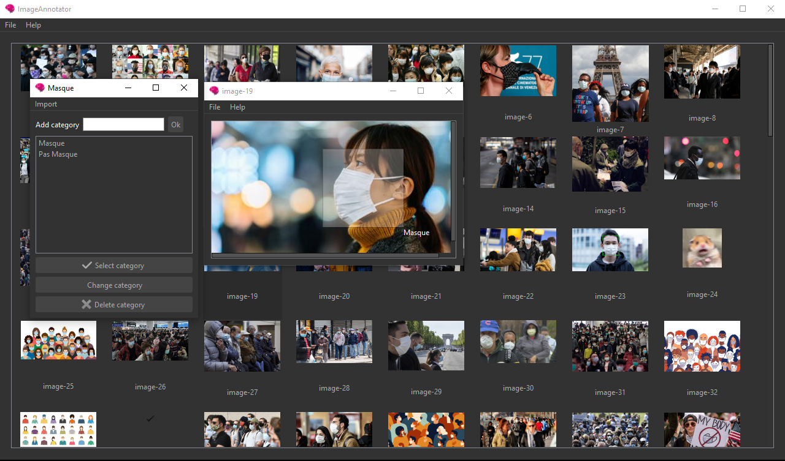
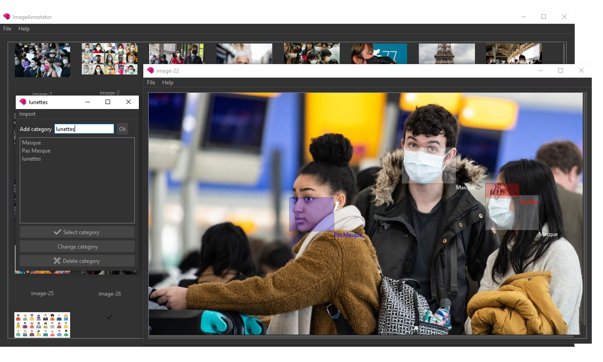
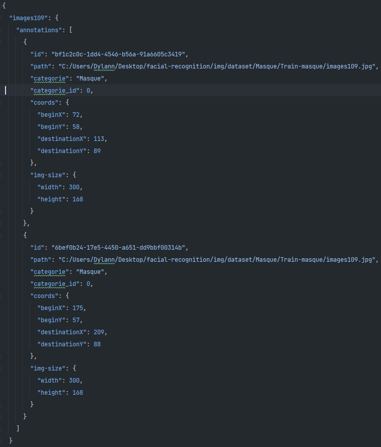

# Facial recognition: the mask / no mask case


## Introduction
Le but de ce projet est de réaliser un logiciel d’annotations d’images en
python pour fournir un data-set à l’IA dans la seconde partie du projet.
Nous avons donnée la possibilité à l’utilisateur d’encadrer une
ou plusieurs régions de l’image puis de lui assigner une cartegorie. Chaque est éditable, 
pour changer la catégorie ou supprimer du cadre au besoin. L’utilisateur
peux sauvegarder toutes ses annotations. D'autres catégories
peuvent être importée, ajoutée ou supprimée.


### Utilisation
NOTE: Pensez à mettre les droits d'éxecution sur le fichier `build.sh` pour installer les dépendances et lancer l'application.
Pour lancer : 
```bash
chmod u+x build.sh
./build.sh
``` 
en étant à la racine du projet.

vérifiez les [requirements](requirements.txt)
  - Python 3.9+
  - Dépendances requises:
    - PySide6==6.2.1
    - Pillow==8.4.0 
    - Shapely==1.8.0
  
 
  - Pour commencer, **ouvrir un fichier ou un dossier** via la menu-bar ou en effectuant un drag and drop sur la zone prévue à cet effet.

  - Une fois le dossier ouvert, **ouvrez une image** en double-cliquant dessus et commencez à annoter. 

  - Pour **selectionner une zone** vous pouvez appuyer sur clique-gauche et étirer jusqu'à la taille souhaitée. 

  - Vous pouvez **selectionner plusieurs zones** sur une même image, ainsi qu'**ajouter des catégories** via le champ editable sur le dessus de la liste.

  - Exemple de **json** fourni par le logiciel
 
  - Pour **supprimer une annotation** faite clique droit sur la zone annotée de l'image.
  - Pour **editer une cagétogrie** double-cliquez dessus pour qu'elle devienne editable, une fois la modification faite, appuyez sur "Change Category" pour valider le changement, qui se reportera dasn le fichier JSON d'annotations.
  - Vous pouvez les raccourcis usuels : 
      - CTRL + S : pour sauvegarder.
      - CTRL + O : pour ouvrir un fichier.
      - CTRL + SHIFT + O : ouvrir un dossier.
      - CTRL + W : pour quitter une image.
      - CTRL + H : pour ouvrir ce README.


#### contributeurs :
- [Dylann B](https://github.com/takitsu21)
- [Margaux Schmied](https://github.com/margauxschmied)
- [Antoine C](https://github.com/MonsieurCo)

